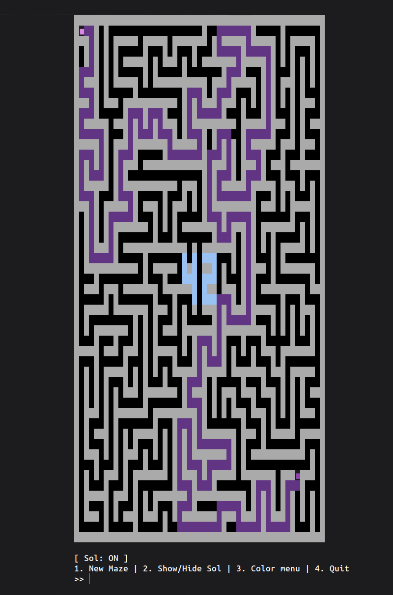

# A-Maze-ing: This is the way


*This project has been created as part of the 42 curriculum by [jubrouss](https://profile-v3.intra.42.fr/users/jubrouss) & [nithomas](https://profile-v3.intra.42.fr/users/nithomas).*

## Description

**A-Maze-ing** is a robust Python maze generator that creates perfect or imperfect mazes using the **Recursive Backtracker** algorithm. The program reads configuration from a text file, generates a random maze with a hidden "42" pattern, finds the shortest path from entry to exit, and outputs the result in hexadecimal format.

It features an **interactive ASCII terminal interface** with customizable colors.

<p align="center">
  
  <br>
</p>

### Key Features
- **Random Generation**: Seed-based reproducibility.
- **Algorithm**: Recursive Backtracker for long, winding corridors.
- **Solver**: BFS-based shortest path finder.
- **Visuals**: Interactive terminal rendering with rich color customization.
- **Modular**: Reusable Python package for integration in other projects.
- **Validated**: Hexadecimal wall encoding for easy validation.

---

## Instructions

### Installation

```bash
# Clone and navigate to the project
git clone <repo_url>
cd a-maze-ing

# Install dependencies (automatically creates a virtual environment)
make install
```

### Usage

```bash
# Run the program
python3 a_maze_ing.py config.txt

# Or use Makefile
make run
```

### Makefile Commands

- `make install` - Install dependencies
- `make run` - Execute the main script
- `make debug` - Run with Python debugger (pdb)
- `make clean` - Remove temporary files (__pycache__, .mypy_cache)
- `make lint` - Run flake8 and mypy type checking
- `make lint-strict` - Run strict linting (optional)

### Interactive Menu

Once running, you can:
1. Generate a new random maze
2. Show/hide the solution path
3. Customize colors (walls, paths, entry, exit, solution, "42")
4. Quit and save to output file

---

## Configuration File Format

The config file uses `KEY=VALUE` format, one per line. Lines starting with `#` are comments.

**Mandatory keys:**

```
WIDTH=51              # Maze width
HEIGHT=50             # Maze height
ENTRY=1,1             # Entry coordinates (x,y)
EXIT=45,44            # Exit coordinates (x,y)
OUTPUT_FILE=maze.txt  # Output filename
PERFECT=True          # Perfect maze? (True/False)
SEED=0                # Seed (0 = random, or specific string)
RENDER=ascii          # Render mode (ascii)
```

**Important:** Width and height must be odd numbers. If numbers are even, the program automatically adds 1.

---

## Maze Generation Algorithm

### Algorithm: Recursive Backtracker (DFS-based)

The **Recursive Backtracker** is a depth-first search approach that carves paths through a grid of walls.

**How it works:**
1. Start at entry cell, mark as visited.
2. Randomly choose an unvisited neighbor (2 cells away).
3. Carve the wall between current and neighbor.
4. Recursively visit the neighbor.
5. Backtrack when no unvisited neighbors remain.

**Implementation:** See `generate.py` - functions `generate()` and `backtrack()`

### Why This Algorithm?

- **Perfect maze guarantee**: Naturally creates mazes with a single path between any two points.
- **Long corridors**: Creates interesting, winding passages.
- **Simple & elegant**: Clean recursive implementation.
- **Easy to modify**: Adding imperfect mode (random wall removal) is straightforward.
- **Memory efficient**: No need for large frontier sets like Prim's algorithm.

> [!NOTE]
> For imperfect mazes (`PERFECT=False`), after generation we randomly remove 5% of walls while ensuring corridors stay narrow (max 2 cells wide).

---

## Code Reusability

### Reusable Module: `module/`

The maze generation logic is isolated in the `module/` directory, allowing you to use it in other projects without the CLI constraints.

### What's in the Module?

**1. `module/models.py`**
- `Maze`: Core class, initialized directly with arguments (width, height, etc.)
- `Cell`: Represents individual grid cells

**2. `module/generator.py`**
- `generate(maze)`: Runs the Recursive Backtracker on the given maze instance

**3. `module/renderer.py`**
- `render(maze)`: Displays the maze in the terminal with colors

**4. `module/seed.py`**
- Seed management utilities

### Usage Example

You can verify the module using the provided test script:
```bash
./venv/bin/python3 test_module.py
```

Code example:
```python
from module import Maze, generate, render

# Initialize a 21x21 perfect maze
maze = Maze(
    width=21,
    height=21,
    entry=(1, 1),
    exit=(19, 19),
    seed="test_seed",
    perfect=True
)

# Optional: Add the "42" pattern
maze.place_42()

# Generate the path
generate(maze)

# Render output
render(maze)
```

---

## Resources

### Classic References

**Maze Algorithms:**
- [Jamis Buck's Maze Algorithms](https://www.jamisbuck.org/mazes/) - Visual explanations
- [Wikipedia: Maze Generation](https://en.wikipedia.org/wiki/Maze_generation_algorithm)

**Python:**
- [PEP 8 - Style Guide](https://peps.python.org/pep-0008/)
- [Type Hints Documentation](https://docs.python.org/3/library/typing.html)

### AI Usage

**Tasks where AI was used:**

1. **Algorithm research** - Compared Prim's, Kruskal's, Recursive Backtracker, Eller's algorithms to choose the best fit
2. **Code structure** - Discussed separation of concerns (parse, generate, solve, render, output)
3. **Debugging** - Fixed wall coherence between neighboring cells and coordinate system issues
4. **Packaging** - Guidance on creating pip-installable modules with setuptools

**What I wrote myself:**
- Recursive backtracker implementation
- BFS solver algorithm
- ASCII rendering system
- Configuration parser with validation
- Interactive menu and color system
- Hexadecimal output formatter

**Validation:**
- Tested with various maze sizes and configurations
- Discussed implementation choices with peers
- Refactored for clarity and maintainability

---

## Team & Project Management

### Roles

**[jubrouss](https://profile-v3.intra.42.fr/users/jubrouss), [nithomas](https://profile-v3.intra.42.fr/users/nithomas)** — Developers
- Core algorithm implementation (generation and solving)
- Terminal rendering and interactive user interface
- Configuration parsing and data validation
- Documentation and packaging

### Project Evolution

**Initial Planning:**
- **Week 1:** Research algorithms, implement generation, develop the solver, and create the rendering engine.
- **Week 2:** Packaging, final testing, and documentation.

**Actual Timeline:**
- **Week 1:** Successfully implemented core generation, though wall coherence issues required a code refactor. Adjusted recursion limits for large-scale mazes and integrated the color system.
- **Week 2:** Finalized hexadecimal output, completed package creation, and conducted comprehensive testing.

**Key Adjustments:**
- Allocated more time than anticipated for wall validation logic.
- Enhanced the visual experience with a dynamic color system.
- Established the "odd-only" dimension requirement during the testing phase.

### What Worked Well

- **Modular Architecture** — Splitting logic into dedicated modules (parse, generate, solve, render) made debugging much more efficient.
- **Incremental Testing** — Developing and testing components independently prevented cascade failures.
- **Interactive Menu** — The terminal-based UI makes the tool engaging and easy to navigate.

### Areas for Improvement

- **Type Hinting** — Type hints were added late in development; they should have been used from the start for better maintainability.
- **Automated Testing** — We relied heavily on manual testing; implementing unit tests (e.g., Pytest) would have increased reliability.
- **Performance** — Very large mazes (100x100+) can be slow due to Python's recursion depth limits.

### Tools Used

**Development:**
- Python 3.10+, VS Code
- Git/GitHub for version control

**Code Quality:**
- **flake8**: PEP 8 compliance
- **mypy**: Static type checking

---

## Output File Format

The maze is saved in hexadecimal format where each cell is one hex digit encoding its walls.

**Wall Encoding (bit flags):**
- Bit 0 (1): North wall
- Bit 1 (2): East wall
- Bit 2 (4): South wall
- Bit 3 (8): West wall

**Examples:**
- `F` (1111) = All walls closed
- `0` (0000) = All walls open
- `3` (0011) = North + East closed
- `A` (1010) = East + West closed

**File structure:**
```
[Row 1: hex digits]
[Row 2: hex digits]
...
[Empty line]
[Entry X] [Entry Y]
[Exit X] [Exit Y]
[Solution path: N,E,S,W letters]
```

---

## License

This project is part of the 42 curriculum.

---

*For questions or contributions, contact [jubrouss](https://profile-v3.intra.42.fr/users/jubrouss), [nithomas](https://profile-v3.intra.42.fr/users/nithomas).*
